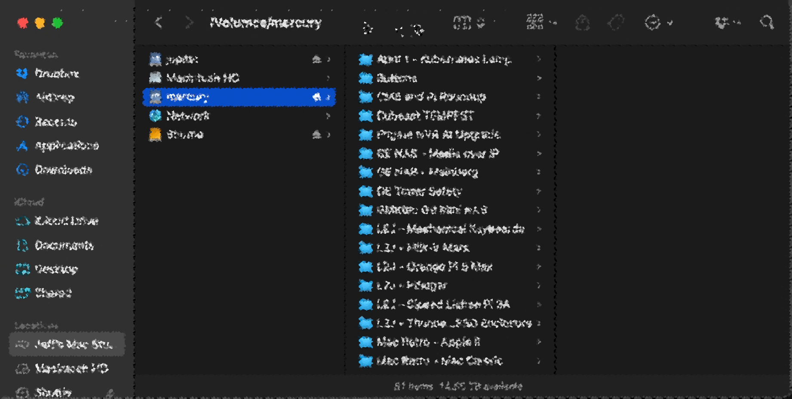
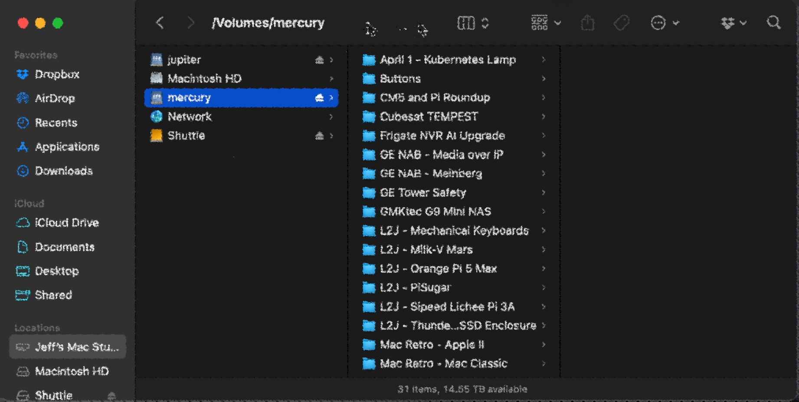

# de-pixelate youtube video gaV-O6NPWrI "Who pays $450 for 2TB?"

\
[input video](gaV-O6NPWrI.webm)\
[full video](https://www.youtube.com/watch?v=gaV-O6NPWrI)

saw the video, looked doable.. did it.\
around 4 hour of coding, quality of code "proof of concept".

## V1

1. extract frames with ffmpeg
2. draw red rectangle around window
3. extract window
4. extract cells
5. accumulate the center pixel of the cells over all frames

\
[result video](v1/accumulated/VIDEO_2025-03-22T13:18:23+0100.webm)

## V2

same as v1 but does the window position detection automatically

\
[result video](v2/accumulated/VIDEO_2025-03-22T15:03:11+0100.webm)
