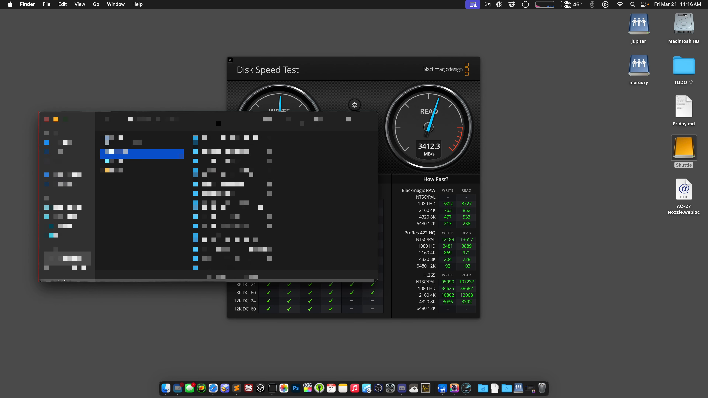
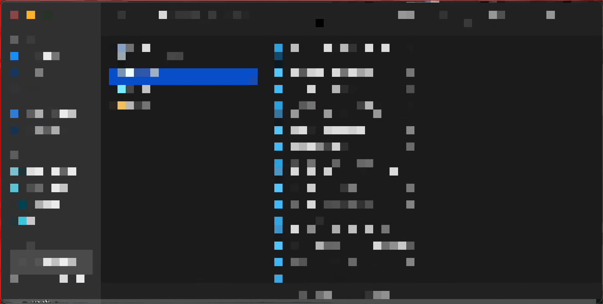
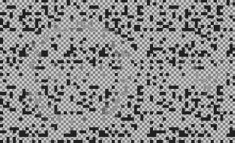
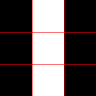
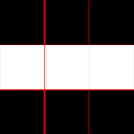
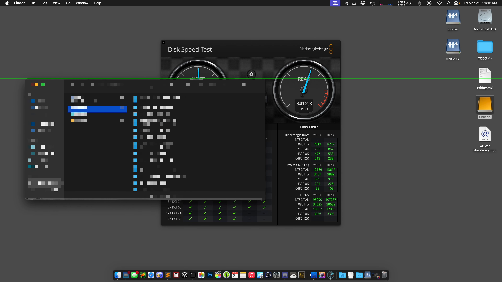

# de-pixelate youtube video gaV-O6NPWrI "Who pays $450 for 2TB?"

first of, huge thanks to jeff for this challenge.\
**i was always under the impression that this should work,\
but never had the opportunity to do it.**

\
[input video](gaV-O6NPWrI.webm)\
[full video](https://www.youtube.com/watch?v=gaV-O6NPWrI)

saw the video, looked doable.. did it.\
around 4 hour of coding, __quality of code "proof of concept"__.

## Explanation

when i saw the video it was immediately clear to me that you might be able restore the original content.

1. the window has a (assumed) static content
2. while moving the window around, the "pixelated" content changed
3. the "pixelated" content moved differently than the window

basically it is like a fence with small holes,\
if the fence moves or the content behind the fence moves.\
you can see more parts of the content behind.

### V1

#### extracting the frames with ffmpeg

```sh
ffmpeg -i "$video_file" -filter_complex "select=bitor(gt(scene\,0.01)\,eq(n\,0))" -vsync drop frames/%04d.png
```

this gave me ~56 frames, i looked through the frames and deleted the frames without the window.

#### finding the window position

since it was only 56 pictures, i did it manually by hand. i used this [template](v1/frames.xcf).\
i just put a red rectangle around the window.



#### extracting the window

pretty simple, just find the first red pixel, from the "finding the window position" step.\
the window size i extracted from gimp `1842px` × `930px`



### extracting the cells (pixels)

i measured the cell size in gimp and it should be `25px`.\
but after some testing the it just didn't work..\
the video might be scaled or the pixelated content might be scaled.\
anyways i just counted the cells and measured it and calculated the grid size `730px/29` × `1763px/70`

here i simply measured the difference of pixels in x and y direction (edge detection).\
and then used the magic value `4`, found by testing, to detect the edges of the cells.\
then i took the first index of the x and y direction of this edge detection as starting coordinates of the grid.\
(i had some other plans here, but thats the approach i ended with)

\
<small>blue lines are from the edge detection, green dots are the centers of the cells</small>

### accumulate the pixels

basically I just take the pixels from the window only at the center of the cells.\
and put them into a picture where they are accumulated.

which resulted in this:\


.. hard to read so i add a fill algorithm, basically i grow all pixels in size until there is no transparent pixels left

which results in something like this:\


which then resulted in this picture for the window

\
[result video](v1/accumulated/output.webm)

this looked very promising, i was pretty sure i could extract the content with more frames.\
but "finding the window position" would be too much work

### V2

same as v1 but does the "finding the window position" automatically.

#### extracting the frames with ffmpeg

```sh
ffmpeg -i "$video_file" -filter_complex "select=bitor(gt(scene\,0.001)\,eq(n\,0))" -vsync drop frames/%04d.png
```

resulted in ~200 frames

#### finding the window position

after some try and error with gimp i came to the following procedure (lots of magic values):

1. threshold filter to `< 45`
2. find the edges with the following `3 × 3px` template\
     and 
3. only take the edges with a value less than `1/256`
4. search for the first edge in `y in range(350, 1900)` and `x in range(0, 1230)`
5. put a red pixel at the intersection of these 2 lines

\
<small>blue line horizontal edge detection, green line vertical edge detection, red dot is the selected window position</small>


### result

\
[result video](v2/accumulated/output.webm)

very nice!\
*<small>(i was more or less jumping around like a small child, couldn't believe it worked that good. seeing it with my own eyes was like magic)</small>*
